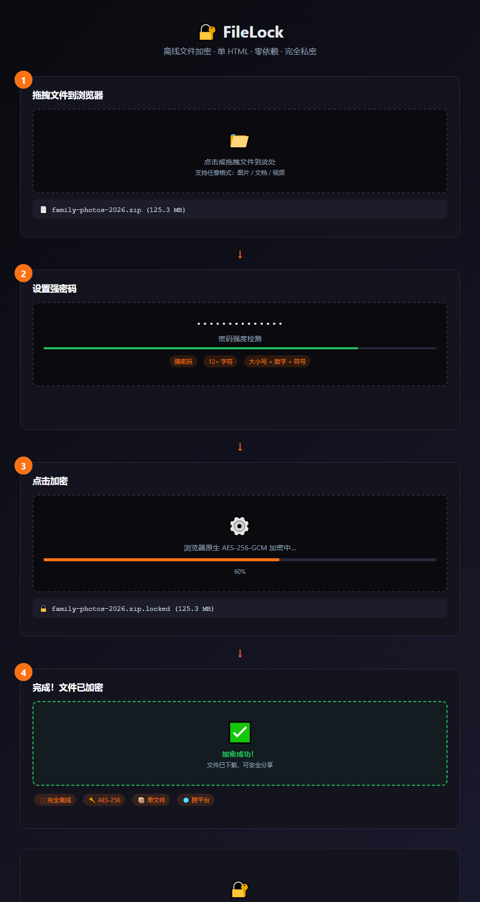

# 🔐 FileLock — 离线文件加密工具

> 一个**单 HTML 文件**的离线文件加密工具，零依赖、完全私密、跨平台。

[](LICENSE)
[](FileLock.html)

## 📸 4 步加密流程



*拖拽文件 → 设置密码 → 加密 → 完成。整个过程在浏览器本地完成，文件从不离开你的设备。*

---

## ✨ 特性

| 特性 | 说明 |
|------|------|
| 🛡 **完全离线** | 使用浏览器原生 Web Crypto API，文件**从不离开你的设备** |
| 🔑 **AES-256-GCM** | 军事级加密标准，全球安全认证 |
| 🔐 **PBKDF2** | 密码经 10 万次迭代派生密钥，暴力破解极难 |
| 📦 **单文件** | 一个 `FileLock.html`，双击即用，无需安装 |
| 🌐 **跨平台** | Windows / macOS / Linux / 手机浏览器均可用 |
| 🎯 **零依赖** | 不联网、不加载任何外部脚本 |

---

## 🚀 使用方法

### 方式一：直接下载
1. 下载 `FileLock.html`
2. 双击用浏览器打开
3. 选择文件 → 设置密码 → 加密

### 方式二：克隆仓库
```bash
git clone https://github.com/wengkit218-pixel/filelock.git
cd filelock
# 用浏览器打开 FileLock.html
```

---

## 📖 使用流程

### 🔒 加密
1. 点击「加密」标签
2. 拖拽或选择要加密的文件
3. 输入强密码（建议 12+ 字符，含大小写+数字+符号）
4. 点击「加密文件」
5. 下载 `.locked` 文件（原始文件名已嵌入，可安全分享）

### 🔓 解密
1. 点击「解密」标签
2. 选择 `.locked` 文件
3. 输入加密时的密码
4. 点击「解密文件」
5. 恢复原文件

---

## 🔐 安全说明

- **密码派生**：PBKDF2-SHA256，10 万次迭代
- **加密算法**：AES-256-GCM（带认证标签，防篡改）
- **随机 IV**：每个文件使用独立随机初始化向量
- **密钥管理**：密钥仅存在于内存，绝不落盘或上传
- **文件格式**：`FLK100` 魔数 + 版本 + Salt + IV + 原始文件名 + 密文

⚠️ **重要**：忘记密码 = 文件永久无法恢复。请务必记住密码！

---

## 🧪 技术实现

```
文件结构（.locked）：
┌─────────────┬────────┬────────┬──────┬────────────┬──────────┬───────────┐
│ MAGIC (6B)  │ VER(1)│ SALT   │ IV   │ NAME_LEN(2) │ NAME     │ CIPHERTEXT│
│ "FLK100"    │ 0x01   │ 16B    │ 12B  │            │ 变长     │ AES-GCM   │
└─────────────┴────────┴────────┴──────┴────────────┴──────────┴───────────┘
```

**依赖：**
- `crypto.subtle` (Web Crypto API) — 现代浏览器原生支持
- 无任何外部库或 CDN

---

## 📋 支持的浏览器

| 浏览器 | 支持 |
|--------|------|
| Chrome / Edge 60+ | ✅ |
| Firefox 55+ | ✅ |
| Safari 11+ | ✅ |
| 手机浏览器 | ✅ |

---

## 🤝 贡献

欢迎 PR！特别是：
- 批量加密
- 文件夹加密
- 中文界面优化
- 更多算法选项

---

## 📄 许可证

[MIT License](LICENSE) — 免费用于个人和商业用途

---

## ⭐ 如果这个工具帮到你，请点个 Star！

你的支持是我继续做开源工具的动力 🚀
